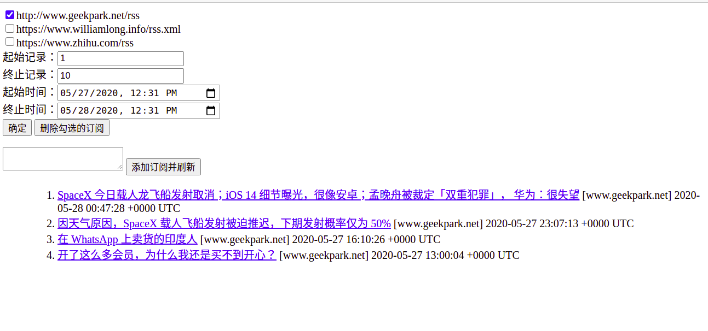

# RSS 阅读器
## 效果图


## 使用方法
```bash
$ go run backend/backend.go
$ go run frontend/frontend.go
$ google-chrome http://localhost:8080/rss.html
```

## 实现原理
frontend 和 backend 之间利用 gRPC 框架来进行通信。

frontend 使用 Gin 框架来搭建web服务器，与用户进行交互，并将用户的请求解析后传递给 backend，backend 收到后处理用户请求，从 Redis 数据库中取出数据，并返回给 frontend ,再返回给用户。

## 待开发
1. 可以实现每个用户一个帐号，而不是现在的共享同一个帐号